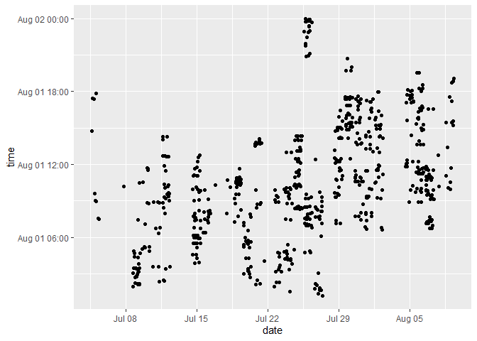

<!-- README.md is generated from README.Rmd. Please edit that file -->

# ghhrs

Based on <https://rpubs.com/hadley/gh>.

``` r
library(gh)
library(purrr)
library(tibble)
library(dplyr)
#> 
#> Attaching package: 'dplyr'
#> The following objects are masked from 'package:stats':
#> 
#>     filter, lag
#> The following objects are masked from 'package:base':
#> 
#>     intersect, setdiff, setequal, union
library(readr)
library(lubridate)
#> 
#> Attaching package: 'lubridate'
#> The following object is masked from 'package:base':
#> 
#>     date
```

``` r
my_repos <- function(type = c("all", "owner", "public", "private", "member"), 
                     limit = 10) {
  type <- match.arg(type)
  
  gh(
    "GET /user/repos",
    type = type, 
    sort = "updated",
    .limit = limit
  )
}
repos <- my_repos("owner", limit = 10)
length(repos)
#> [1] 10

full_name <- repos %>% map_chr("full_name")
head(full_name, 20)
#>  [1] "maurolepore/r2dii.dataprep"       
#>  [2] "maurolepore/r2dii.dataraw"        
#>  [3] "maurolepore/ghhrs"                
#>  [4] "maurolepore/junr"                 
#>  [5] "maurolepore/DCC"                  
#>  [6] "maurolepore/drake"                
#>  [7] "maurolepore/drake-manual"         
#>  [8] "maurolepore/Reference"            
#>  [9] "maurolepore/covr"                 
#> [10] "maurolepore/maurolepore.github.io"

repo_commits <- function(full_name, since = "2019-01-01") {
  message("Requesting commits for ", full_name)
  
  commits <- gh("GET /repos/:full_name/commits", 
    full_name = full_name, 
    since = since,
    .limit = Inf
  )
  
  if (length(commits) == 0) {
    return(NULL)
  }
  
  tibble(
    full_name = full_name,
    author = commits %>% map_chr(c("author", "login"), .null = NA_character_),
    datetime = commits %>% map_chr(c("commit", "author", "date"), .null = NA_character_)
  )
}

commits <- full_name %>% map(repo_commits) %>% compact() %>% bind_rows()
#> Requesting commits for maurolepore/r2dii.dataprep
#> Requesting commits for maurolepore/r2dii.dataraw
#> Requesting commits for maurolepore/ghhrs
#> Requesting commits for maurolepore/junr
#> Requesting commits for maurolepore/DCC
#> Requesting commits for maurolepore/drake
#> Requesting commits for maurolepore/drake-manual
#> Requesting commits for maurolepore/Reference
#> Requesting commits for maurolepore/covr
#> Requesting commits for maurolepore/maurolepore.github.io
commits
#> # A tibble: 4,011 x 3
#>    full_name                  author      datetime            
#>    <chr>                      <chr>       <chr>               
#>  1 maurolepore/r2dii.dataprep maurolepore 2019-08-10T00:03:35Z
#>  2 maurolepore/r2dii.dataprep maurolepore 2019-08-09T23:49:37Z
#>  3 maurolepore/r2dii.dataprep maurolepore 2019-08-09T23:43:52Z
#>  4 maurolepore/r2dii.dataprep maurolepore 2019-08-09T22:34:35Z
#>  5 maurolepore/r2dii.dataprep maurolepore 2019-08-09T22:12:39Z
#>  6 maurolepore/r2dii.dataprep maurolepore 2019-08-09T20:33:47Z
#>  7 maurolepore/r2dii.dataprep maurolepore 2019-08-09T20:26:50Z
#>  8 maurolepore/r2dii.dataprep maurolepore 2019-08-09T20:26:38Z
#>  9 maurolepore/r2dii.dataprep maurolepore 2019-08-09T20:13:27Z
#> 10 maurolepore/r2dii.dataprep maurolepore 2019-08-09T18:23:10Z
#> # ... with 4,001 more rows
```

``` r
commits <- commits %>% mutate(
  datetime = lubridate::with_tz(readr::parse_datetime(datetime), "America/Chicago"),
  date = floor_date(datetime, "day"),
  time = update(datetime, yday = 1)
)
#> Warning in (function (object, years = integer(), months = integer(), days =
#> integer(), : partial argument match of 'yday' to 'ydays'
commits
#> # A tibble: 4,011 x 5
#>    full_name author datetime            date               
#>    <chr>     <chr>  <dttm>              <dttm>             
#>  1 maurolep~ mauro~ 2019-08-09 19:03:35 2019-08-09 00:00:00
#>  2 maurolep~ mauro~ 2019-08-09 18:49:37 2019-08-09 00:00:00
#>  3 maurolep~ mauro~ 2019-08-09 18:43:52 2019-08-09 00:00:00
#>  4 maurolep~ mauro~ 2019-08-09 17:34:35 2019-08-09 00:00:00
#>  5 maurolep~ mauro~ 2019-08-09 17:12:39 2019-08-09 00:00:00
#>  6 maurolep~ mauro~ 2019-08-09 15:33:47 2019-08-09 00:00:00
#>  7 maurolep~ mauro~ 2019-08-09 15:26:50 2019-08-09 00:00:00
#>  8 maurolep~ mauro~ 2019-08-09 15:26:38 2019-08-09 00:00:00
#>  9 maurolep~ mauro~ 2019-08-09 15:13:27 2019-08-09 00:00:00
#> 10 maurolep~ mauro~ 2019-08-09 13:23:10 2019-08-09 00:00:00
#> # ... with 4,001 more rows, and 1 more variable: time <dttm>
```

``` r
commits %>% count(full_name, sort = TRUE) %>% print(n = 20)
#> # A tibble: 10 x 2
#>    full_name                             n
#>    <chr>                             <int>
#>  1 maurolepore/drake                  1582
#>  2 maurolepore/r2dii.dataraw          1021
#>  3 maurolepore/Reference               984
#>  4 maurolepore/drake-manual            245
#>  5 maurolepore/maurolepore.github.io    71
#>  6 maurolepore/DCC                      37
#>  7 maurolepore/covr                     31
#>  8 maurolepore/junr                     25
#>  9 maurolepore/r2dii.dataprep           14
#> 10 maurolepore/ghhrs                     1

commits %>% count(author, sort = TRUE)
#> # A tibble: 33 x 2
#>    author            n
#>    <chr>         <int>
#>  1 maurolepore    1324
#>  2 wlandau        1078
#>  3 wlandau-lilly   626
#>  4 2diiKlaus       278
#>  5 Clare2D         278
#>  6 blumoestit      196
#>  7 bpbond           50
#>  8 MilesMcBain      30
#>  9 ronnyhdez        28
#> 10 jimhester        25
#> # ... with 23 more rows
```

``` r
library(ggplot2)
library(forcats)  # devtools::install_github("hadley/forcats")
library(ggbeeswarm) # devtools::install_github("eclarke/ggbeeswarm")
```

``` r
mauro <- commits %>% 
  filter(author == "maurolepore")

mauro
#> # A tibble: 1,324 x 5
#>    full_name author datetime            date               
#>    <chr>     <chr>  <dttm>              <dttm>             
#>  1 maurolep~ mauro~ 2019-08-09 19:03:35 2019-08-09 00:00:00
#>  2 maurolep~ mauro~ 2019-08-09 18:49:37 2019-08-09 00:00:00
#>  3 maurolep~ mauro~ 2019-08-09 18:43:52 2019-08-09 00:00:00
#>  4 maurolep~ mauro~ 2019-08-09 17:34:35 2019-08-09 00:00:00
#>  5 maurolep~ mauro~ 2019-08-09 17:12:39 2019-08-09 00:00:00
#>  6 maurolep~ mauro~ 2019-08-09 15:33:47 2019-08-09 00:00:00
#>  7 maurolep~ mauro~ 2019-08-09 15:26:50 2019-08-09 00:00:00
#>  8 maurolep~ mauro~ 2019-08-09 15:26:38 2019-08-09 00:00:00
#>  9 maurolep~ mauro~ 2019-08-09 15:13:27 2019-08-09 00:00:00
#> 10 maurolep~ mauro~ 2019-08-09 13:23:10 2019-08-09 00:00:00
#> # ... with 1,314 more rows, and 1 more variable: time <dttm>
```

To start, lets figure out what I’ve been working on. I’ll just look at
the top 25 repos.

``` r
mauro %>% 
  mutate(repo = full_name %>% fct_reorder(date) %>% fct_rev() %>% fct_lump(25)) %>% 
  ggplot(aes(date, repo)) + 
  geom_quasirandom(size = 0.5)
#> Warning in rank(-count, ties = ties.method): partial argument match of
#> 'ties' to 'ties.method'
#> Warning in f(...): The default behavior of beeswarm has changed in version
#> 0.6.0. In versions <0.6.0, this plot would have been dodged on the y-
#> axis. In versions >=0.6.0, groupOnX=FALSE must be explicitly set to group
#> on y-axis. Please set groupOnX=TRUE/FALSE to avoid this warning and ensure
#> proper axis choice.
```

<!-- -->

What times of day do I usually work on things?

``` r
mauro %>% 
  ggplot(aes(date, time)) + 
  geom_quasirandom()
```

<!-- -->

Finally, we can look at my average work week by breaking down by day of
week, and focussing on my usual working hours.

``` r
mauro %>% 
  mutate(wday = wday(date, label = TRUE) %>% fct_shift(1) %>% fct_rev()) %>% 
  # filter(hour(time) >= 6, hour(time) <= 18) %>% 
  ggplot(aes(time, wday)) + 
  geom_quasirandom() 
#> Warning in f(...): The default behavior of beeswarm has changed in version
#> 0.6.0. In versions <0.6.0, this plot would have been dodged on the y-
#> axis. In versions >=0.6.0, groupOnX=FALSE must be explicitly set to group
#> on y-axis. Please set groupOnX=TRUE/FALSE to avoid this warning and ensure
#> proper axis choice.
```

<!-- -->
